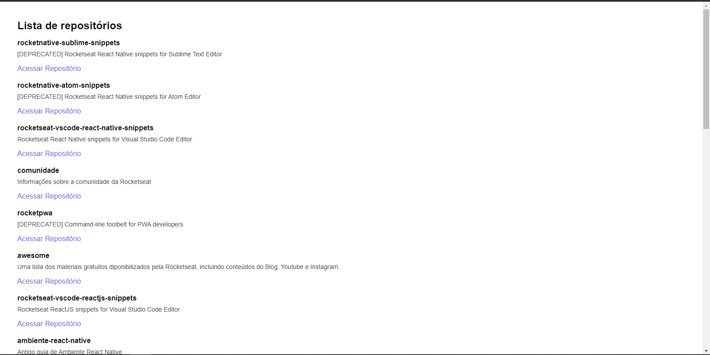

Github Explorer
=========================================
Projecto de desenvolvido no **Ignite**, treinamento de ReactJS da **Rocketseat**, 
que tem como objectivo listar repositórios de um usuário usando a API do Github

 
